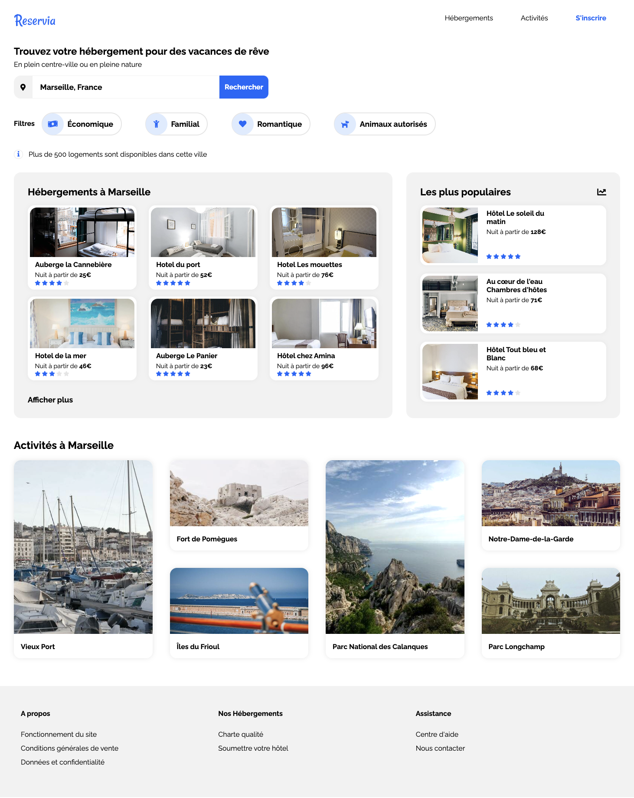

<h1 align="center">Welcome to Reservia 👋</h1>

  

> Intégration de la maquette d'un site de réservation d'hébergements.

Reservia homegage

### 🏠 [Homepage](https://github.com/VGMSoft/VirgileGuglielmi_2_17112020)

### ✨ [Demo](https://vgmsoft.github.io/VirgileGuglielmi_2_17112020/)

## Author

👤 **Virgile Guglielmi**

* Website: virgileg.com
* Twitter: [@virgilegug](https://twitter.com/virgilegug)
* Github: [@VGMSoft](https://github.com/VGMSoft)

## Show your support

Give a ⭐️ if this project helped you!

***
_This README was generated by [readme-md-generator](https://github.com/kefranabg/readme-md-generator)_